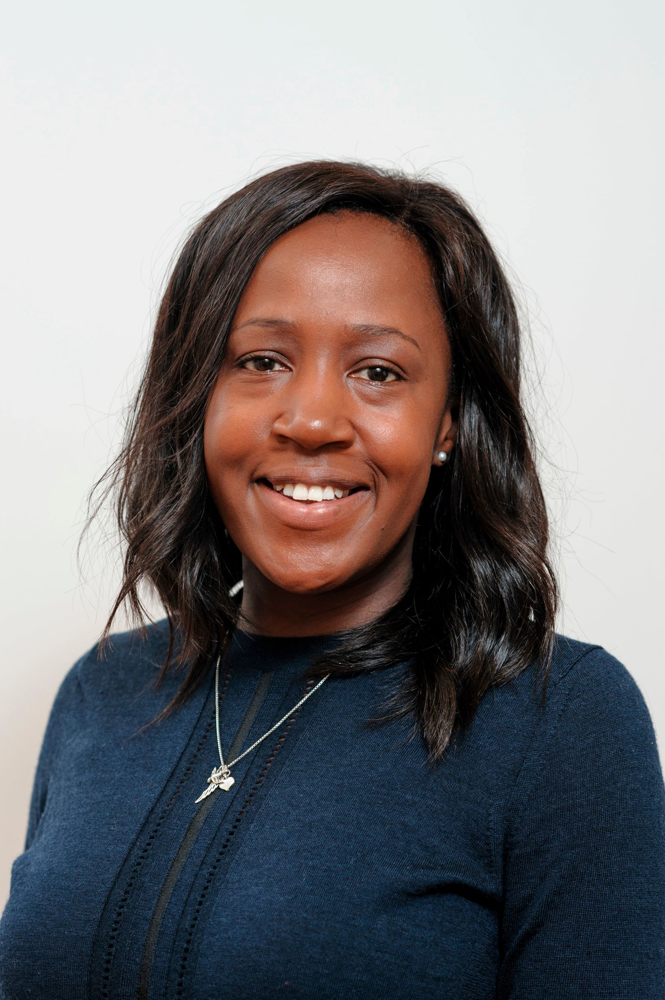
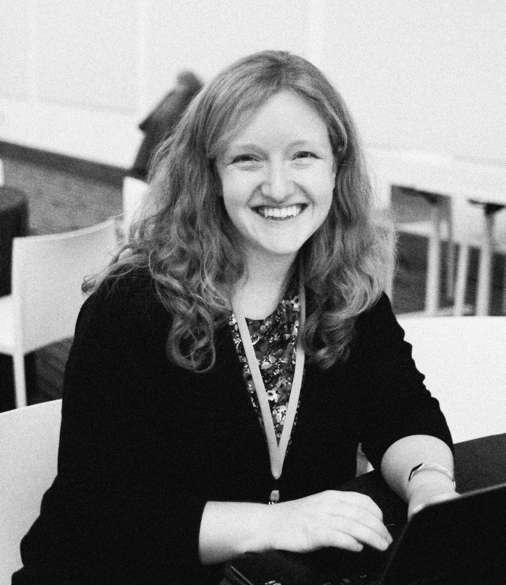

```{r setup, include=FALSE}
options(htmltools.dir.version = FALSE)
```

```{r xaringan-themer, include=FALSE, warning=FALSE}
library(xaringanthemer)
style_duo_accent(
  primary_color = "#593674",
  secondary_color = "#FCAF17",
  inverse_header_color = "#FFFFFF", 
  #  background_color = "#D7D8D2"
  # background_color = "#FFEFCF"
  extra_css = list("h2" = list("margin-block-start" = "0.25em", 
                               "margin-block-end" = "0.25em"), 
                   "h3" = list("margin-block-start" = "0.25em", 
                               "margin-block-end" = "0em"), 
                   "h4" = list("margin-block-start" = "0em", 
                               "margin-block-end" = "0em", 
                               "padding-left" = "2%", 
                               "padding-right" = "2%", 
                               "font-weight" = "300", 
                               "font-size" = "1.25em")
  )
)
```
class: inverse, center, middle

# Speakers

---
class: split-33

.column.bg-main1[.content.vmiddle.center[

]]

.column.bg-main2[.content.vmiddle[
## Why & how to embrace Open Science
### Emily Sena
#### Stroke Association Kirby Laing Foundation Senior Lecturer, University of Edinburgh
#### Editor-in-Chief, BMJ Open Science

### Friday, January 15 2021, 0900am ET

]]
---
class: split-33

.column.bg-main1[.content.vmiddle.center[

]]

.column.bg-main2[.content.vmiddle[
## The Turing Way: Empower researchers in reproducible, ethical, inclusive and collaborative science
### Kirstie Whitaker
#### Programme Lead for Tools, Practices and Systems, The Alan Turing Institute

### Friday, February 12 2021, 0900am ET

]]
---
class: split-33

.column.bg-main1[.content.vmiddle.center[

]]

.column.bg-main2[.content.vmiddle[
## Translational research – Lost in the garden of the forking paths
### Ulrich Dirnagl
#### Director, Department of Experimental Neurology, Charité Universitätsmedizin Berlin
#### Founding Director, BIG Quest Center for Transforming Biomedical Research

### Friday, March 12 2021, 0900am ET

]]
---
class: split-33

.column.bg-main1[.content.vmiddle.center[

]]

.column.bg-main2[.content.vmiddle[
## 
### Malcolm Macleod
#### Professor of Neurology and Translational Neuroscience, University of Edinburgh
#### Academic Lead for Research Improvement and Research Integrity, University of Edinburgh

### Friday, April 9 2021, 0900am ET

]]
---
class: split-33

.column.bg-main1[.content.vmiddle.center[

]]

.column.bg-main2[.content.vmiddle[
## 
### Maryann Martone
#### Professor Emeritus, Neurosciences, University of California San Diego

### Friday, June 11 2021

]]
---
class: split-33

.column.bg-main1[.content.vmiddle.center[

]]

.column.bg-main2[.content.vmiddle[
## Building a culture of computational reproducibility
### Russ Poldrack
#### Albert Ray Lang Professor of Psychology, Stanford University
#### Director, Stanford Center for Reproducible Neuroscience

### Friday, September 24 2021

]]
---